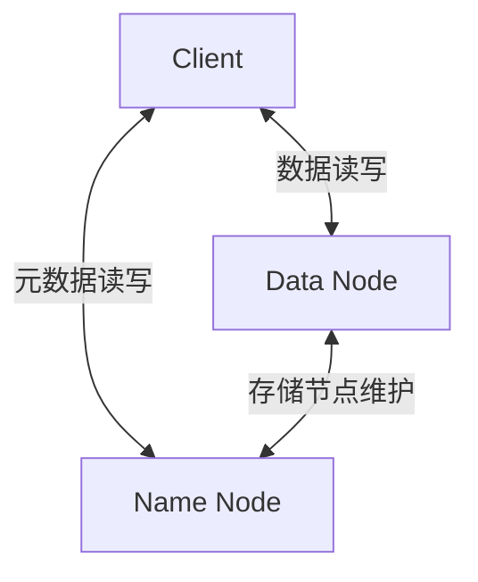
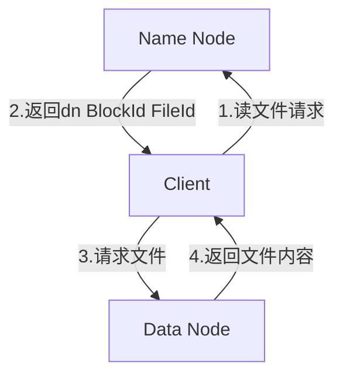
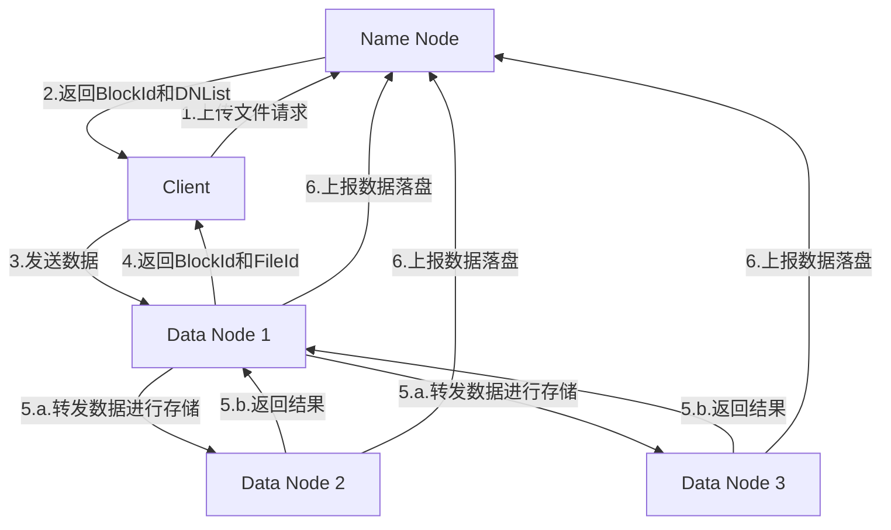

# 项目整体设计

[TOC]

## 感知结构

结合项目要求，整个项目将主要包含Client、Name Node、Data Node三
个组件。

三个组件的主要交互关系如下：

读数据主要流程如下：

写数据主要流程如下：

## 主要功能

### Client

1. 能够访问Name Node和Data Node
2. 通过终端命令的方式调用各API
3. 通过HTTP的方式或RPC的方式进行调用

|API|功能|备注|
|:---:|:---:|:---:|
|Put|存数据|Overwrite、Not Found、Parent Not Found、一致性|
|Get|读数据|选择哪个读、遇到异常如何切换|
|Delete|删数据|删除结果是否有意义、删除成功如何定义|
|Stat|获取文件信息|参考Linux文件系统|
|Mkdir|建目录||
|Rename|重命名||
|List|ls|参考`ls`命令|

### Name Node

1. 至少2个Name Node，Active和Standby
2. Active挂掉Standby能顶上
3. 元数据的存储
4. Active和Standby之间的一致性：Raft协议

接口：

1. 接收自Client的请求
   1. 读数据
   2. 写数据
   3. 目录操作
   4. 元信息
2. 接收自Data Node的请求
   1. Data Node登录的请求
   2. Data Node数据落盘的结果
3. 接收自Name Node的请求
   1. 元数据更新

### Data Node

1. 至少3个Name Node，1主2从
2. DN之间的数据交换
3. 单点故障问题
4. 存储引擎的组织方式

接口

1. 接收自Client的请求
   1. 读数据
   2. 写数据的内容
2. 接收自Data Node的请求
   1. 写数据的内容
   2. 写数据完成的返回
3. 接收自Name Node的请求
   1. 创建块
   2. 更新块

## 技术选型

1. 基础的调用方式
   鉴于启动时必须通过命令行的方式来启动，所以应该至少保证一个终端命令的调用方式，对终端命令的配置采用库`github.com/urfave/cli`
2. 通信协议
   Client、NN、DN之间都需要通信，使用RPC协议进行各个节点之间的通信。RPC协议选用grpc和protobuf，这套协议使用方式比较简单，并且跨平台的支持也不错。[一个简单的grpc使用教程](https://blog.csdn.net/SHELLCODE_8BIT/article/details/122987268)
3. 配置方式
   通过yaml文件进行配置，基于`gopkg.in/yaml.v3`库

## 目录结构

1. client
   存放客户端实现逻辑
2. datanode
   存放DN的实现逻辑
3. namenode
   存放NN的实现逻辑
4. command
   解析所有的终端命令
5. config
   配置文件存放，包括全局设置、client的设置、DN和NN的设置
6. utils
   一些其他功能性组件，如日志
